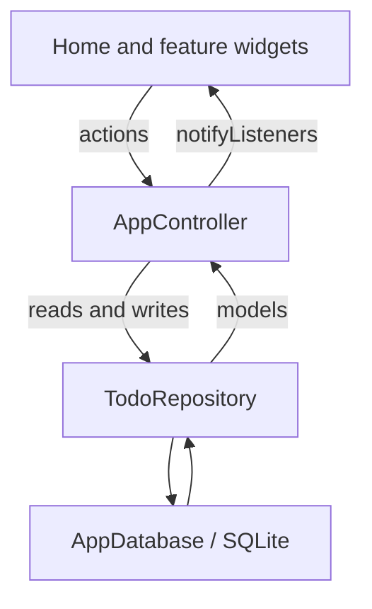

# Architecture

This describes the current Flutter implementation. Product rules and persistence details live in [behavior](docs/behavior.md) and [database](docs/database.md).

## Components

```text
lib/
├── main.dart                       runApp entry point
├── app/
│   ├── better_todo_app.dart       MaterialApp and theme
│   └── app_controller.dart        Shared state and operations
├── data/
│   ├── local/app_database.dart    SQLite open, schema, migrations
│   ├── models/todo_models.dart    Domain objects and row mapping
│   └── repositories/todo_repository.dart  Persistence operations
├── features/
│   ├── home/                      Main screen and drawer
│   ├── regular/                   Regular and protected lists
│   └── schedule/                  Agenda and calendar
├── theme/                         Colors and Material theme
└── widgets/                       Shared dialogs, labels, export formatting
android/                            Android host and resources
docs/                               Guides and VitePress project
```

## Startup and state flow

`main()` starts `BetterTodoApp`, which creates a dark `MaterialApp` with `HomePage` as its home. The home screen uses `AppController`, a `ChangeNotifier`, to load lists, people, check-ins, and the selected list's tasks. On first startup, the controller creates the permanent Schedule list if it is missing and selects the pinned list when available.



The controller also holds transient view state: selected list, agenda or calendar mode, visible month, selected day, loading/error state, and a shared unlock flag. After changes it reloads affected lists or task collections and notifies listeners. The unlock flag is not a persistent authentication token; the UI relocks when the application is backgrounded.

## Presentation

The home feature owns top-level navigation and list selection. Schedule and regular-list pages render their respective tasks and use shared dialogs and widgets for editing, assignees, subtasks, and export text. `AppTheme` and `AppColors` define the dark visual system. No routing or external state-management package is used.

## Persistence

`TodoRepository` translates model objects to SQLite rows. `AppDatabase.instance` opens `better_todo.db` lazily in the platform database directory, enables foreign keys, creates the current schema, and applies versioned upgrades. The current schema version is 6. Task order is stored in `sort_position`; day keys use `YYYY-MM-DD` strings and timestamps use epoch milliseconds. Repository transactions cover operations that update several related rows, such as pinning, reordering, subtask replacement, and person deletion.

There are separate tables and models for scheduled and regular tasks. Subtasks refer to exactly one kind of parent task. Deleting a list cascades to its tasks; deleting a section leaves its tasks unsectioned. See the [database guide](docs/database.md) for table and migration details.

## Android and documentation boundaries

`android/` is the Flutter host, Gradle configuration, launcher resources, and a minimal `FlutterActivity`. Application behavior is implemented in Dart. There is no application server or network service.

`docs/` is a separate npm project. VitePress includes this document, the root README, and `AGENTS.md` through small wrapper pages. It builds a static site and does not participate in the Flutter or Android build. See the [website guide](docs/README.md).
