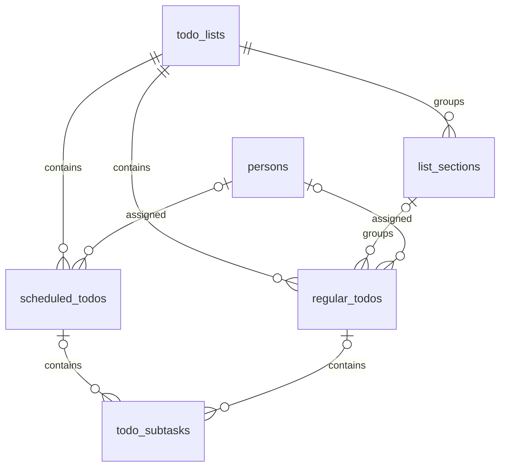

# Local database

The implementation is in [AppDatabase](../lib/data/local/app_database.dart), [TodoRepository](../lib/data/repositories/todo_repository.dart), and [models](../lib/data/models/todo_models.dart). SQLite is the persistent source of truth; controller collections are reloadable views.

## Opening and representation

`AppDatabase.instance` lazily opens `better_todo.db` under `getDatabasesPath()` using `sqflite`. The current schema version is **6**. Foreign keys are enabled in `onConfigure`. Fresh creation builds the current tables; `onUpgrade` applies version steps in order.

- Entity IDs are integers. Most tables also have creation and update timestamps as epoch milliseconds.
- Calendar days use zero-padded `YYYY-MM-DD` strings; scheduled time is an optional minute from 0 to 1439.
- Boolean fields use 0 or 1. Order uses `sort_position`.
- The password in `app_settings` is plain text; the database is not encrypted.

## Tables

| Table             | Purpose                                                    |
| ----------------- | ---------------------------------------------------------- |
| `app_settings`    | Singleton password setting                                 |
| `persons`         | Assignees, including the protected `Me` row                |
| `daily_pride`     | One answer per day: `yes`, `middle`, or `no`               |
| `todo_lists`      | Schedule, regular, and protected list flags; pin and order |
| `list_sections`   | Optional grouping within regular lists                     |
| `scheduled_todos` | Dated tasks, optional time, completion and order           |
| `regular_todos`   | Undated tasks, optional section, completion and order      |
| `todo_subtasks`   | Ordered subtasks attached to exactly one task type         |

A subtask has either `scheduled_todo_id` or `regular_todo_id`, enforced by a check constraint. List deletion cascades through sections and tasks to subtasks. Section deletion sets a regular task's `section_id` to null. Foreign-key deletion of a person would clear assignments, but the repository's person-deletion operation first reassigns that person's tasks to the owner.

## Writes and migrations

The repository uses transactions for multi-row operations: pinning, list/section/task ordering, replacing subtasks, moving a scheduled task, and deleting a person with reassignment. Single-row edits use direct updates. Position values are spaced by 1000 and normalized when reordered.

Versioned upgrades add: a default Schedule pin (v2), subtasks (v3), descriptions (v4), people and assignee references (v5), and daily check-ins (v6). A fresh v6 database creates all of these directly. Validate new migrations against both fresh creation and an older disposable database; retain existing user data.

The app does not currently provide cloud backup or synchronization. Export creates readable text for one list; it is not a full database backup.
